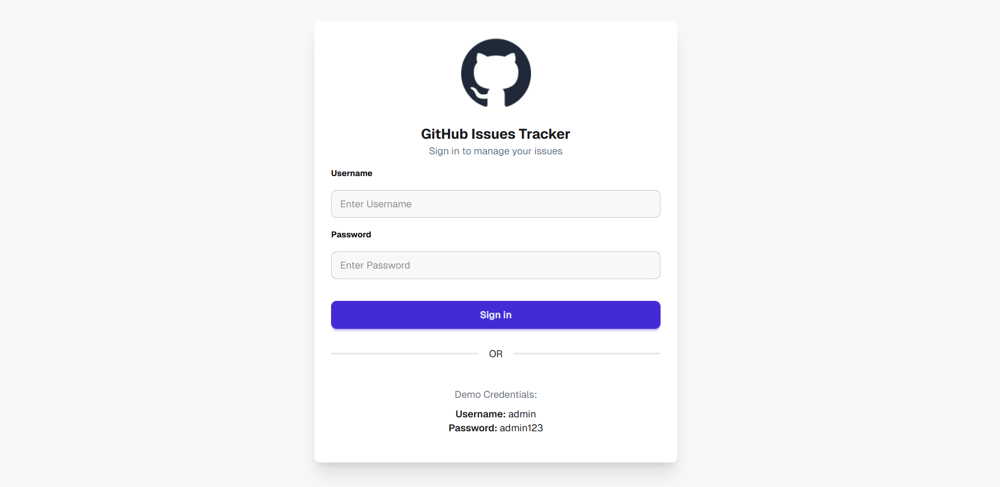
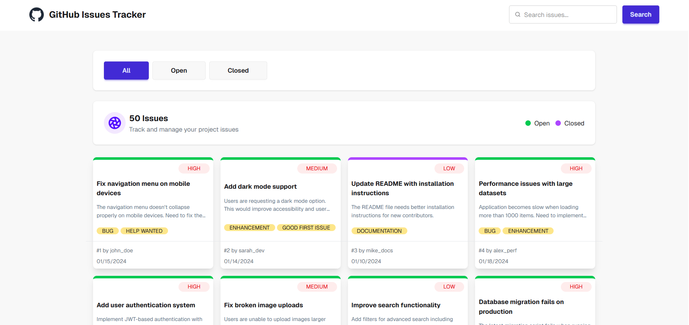
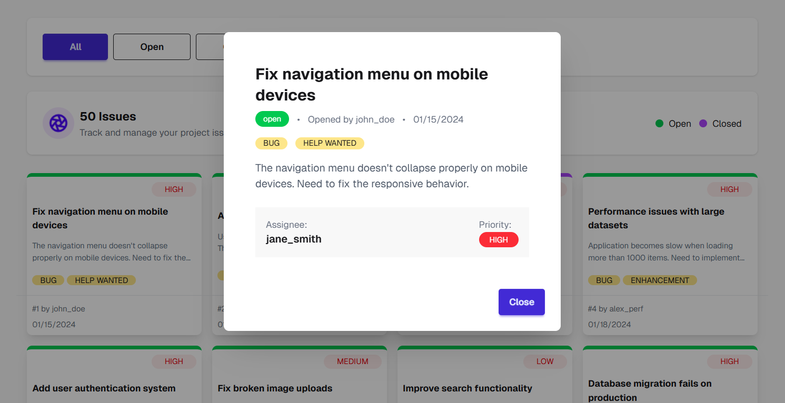

# GitHub Issues Tracker

**GitHub Issues Tracker** is a web application that allows users to view, search, and interact with GitHub-style issues. Users can browse all issues, filter by status (Open/Closed), view issue details in a modal, and search for specific issues.

The design is based on **Figma**, with a clean, responsive, and user-friendly interface.


## 📌 Project Overview

This application dynamically loads issue data from APIs and presents them in interactive cards.  
Users can:

- Browse all issues
- Filter issues by status (All, Open, Closed)
- View issue details in a modal
- Search issues by keywords
- See priority, labels, author, and creation date

The project also includes **login functionality** with demo credentials and a responsive UI for mobile devices.


## 🔗 Live Project

- Live Site: https://github-issues-tracker-assignment-05.netlify.app/ 
- Repository: https://github.com/nahidforever/B13-Assignment-05


## 📸 Project Demo

<p align="center">
<b>Login Page</b><br>

</p>

<p align="center">
<b>All Issues View</b><br>

</p>

<p align="center">
<b>Issue Details Modal</b><br>

</p>


## 🚀 Technology Stack

- HTML5  
- CSS3 (Vanilla / Tailwind CSS / DaisyUI)  
- JavaScript (Vanilla)  


## ✨ Key Features

### 🎨 Design Part
- **Login Page:** logo, title, subtitle, username/password inputs, sign-in button, and demo credentials.
- **Main Page:**
  - Navbar with website logo/name on left
  - Search input and button on right
  - Tabs section (All, Open, Closed)
  - Card layout showing issue count, status markers, and icons
- Fully responsive UI for mobile and desktop

### ⚙️ Functionalities
- **Login:** Use default credentials to access main page  
  - Username: `admin`  
  - Password: `admin123`
- **Issues Display:** Cards in 4-column layout by default showing all issues
- **Tabs Filtering:** Click tabs to show Open, Closed, or All issues
- **Issue Card Details:** Title, Description, Status, Author, Priority, Label, CreatedAt
- **Modal:** Clicking a card shows full issue details
- **Active Tab Indicator**: Highlights the selected tab
- **Card Border:** Top border color based on status (Open → Green, Closed → Purple)
- **Loading Spinner:** Appears while data is being fetched
- **Search Functionality:** Search for issues by keyword


## 📝 API Endpoints

### All Issues
```
https://phi-lab-server.vercel.app/api/v1/lab/issues
```

### Single Issue
```
https://phi-lab-server.vercel.app/api/v1/lab/issue/{id}
Example: https://phi-lab-server.vercel.app/api/v1/lab/issue/33
```

### Search Issues
```
https://phi-lab-server.vercel.app/api/v1/lab/issues/search?q={searchText}
Example: https://phi-lab-server.vercel.app/api/v1/lab/issues/search?q=notifications
```

---

## 💻 Run the Project Locally

1️⃣ **Clone the repository**
```bash
git clone https://github.com/nahidforever/B13-Assignment-05
```

2️⃣ **Navigate to Project Folder**
```bash
cd github-issues-tracker
```

3️⃣ **Open index.html in your browser**  
No build step required since this is a vanilla JS project.

4️⃣ **Demo credentials**  
- Username: `admin`  
- Password: `admin123`

</br>


## 📝 JS & HTML Questions Answered

**1️⃣ What is the difference between var, let, and const?**  
- `var` → function scoped, can be redeclared, hoisted  
- `let` → block scoped, cannot be redeclared, can be reassigned  
- `const` → block scoped, cannot be redeclared or reassigned

**2️⃣ What is the spread operator (...)?**  
- Allows expanding iterable objects (arrays, objects) into individual elements  
```javascript
const arr = [1,2]; const newArr = [...arr,3]; // [1,2,3]
```

**3️⃣ Difference between map(), filter(), and forEach():**  
- `map()` → returns a new array after applying a function  
- `filter()` → returns a new array with elements that pass a condition  
- `forEach()` → executes a function for each element, does **not** return a new array

**4️⃣ What is an arrow function?**  
- Shorter syntax for writing functions:  
```javascript
const add = (a,b) => a+b;
```

**5️⃣ What are template literals?**  
- String literals with backticks (`` ` ``) that allow embedding expressions and multi-line strings:  
```javascript
const name = 'Nahid';
console.log(`Hello, ${name}!`);
```

